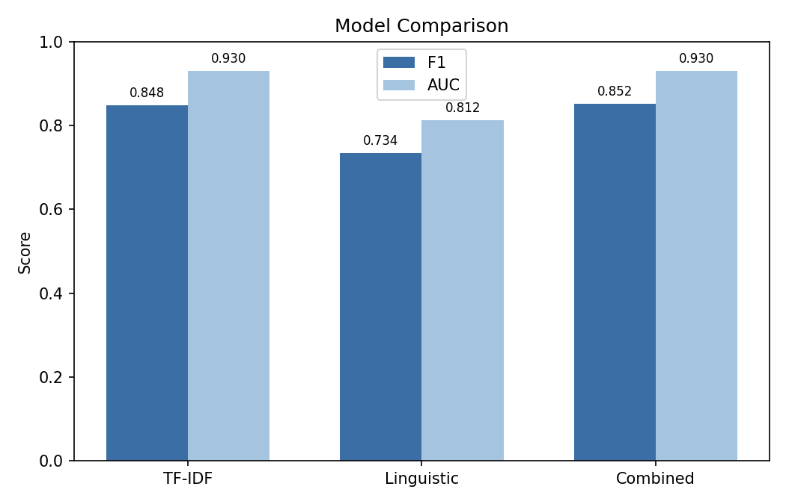
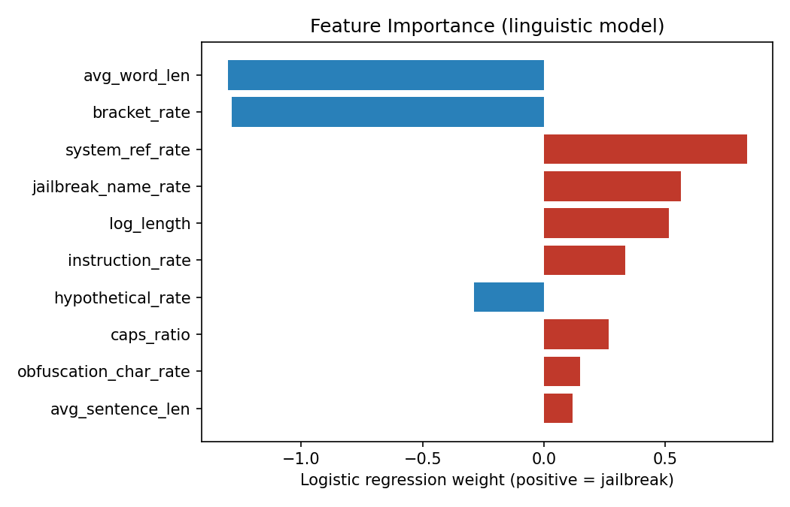

# Interpretable Detection of LLM Jailbreak Prompts

Detecting jailbreak prompts by measuring *how they are written* rather than
relying on an opaque model. This project compares a standard TF-IDF baseline
against a set of 14 hand-designed linguistic features, and shows that combining
the two yields the best performance while retaining interpretability.

## Dataset

The [In-The-Wild Jailbreak Prompts](https://github.com/verazuo/jailbreak_llms)
dataset (Shen et al., ACM CCS 2024) , 1,405 real jailbreak prompts collected
from Reddit, Discord, and prompt-sharing sites, paired with an equal random
sample of regular prompts. The balanced dataset contains 2,748 prompts (50%
jailbreak, 50% benign). It ships in `data/prompts.csv` and can be regenerated
from source with `python src/build_dataset.py`.

## Method

Each prompt is converted into 14 features across four conceptual groups. All
marker features are computed as **rates per 100 words** to control for the fact
that jailbreak prompts tend to be much longer than benign ones , a raw count
would otherwise conflate length with intent.

| Group | Features |
|-------|----------|
| Structure | avg. sentence length, avg. word length, word variety, log length, capital-letter ratio, special-character ratio |
| Attack markers | persona-injection rate, rule-override rate, jailbreak-name rate |
| Rule references | AI-policy reference rate, hypothetical-framing rate |
| Obfuscation | encoding-keyword rate, intra-word character obfuscation rate, bracket-notation rate |

Three logistic-regression models are trained and compared on an identical 70/30
stratified train/test split:

- **TF-IDF** , 500 top terms (standard vocabulary baseline)
- **Linguistic** , the 14 features above
- **Combined** , both feature sets concatenated

## Results

| Model | Precision | Recall | F1 | AUC |
|-------|-----------|--------|-----|-----|
| TF-IDF | 0.850 | 0.849 | 0.848 | 0.930 |
| Linguistic | 0.737 | 0.735 | 0.734 | 0.812 |
| **Combined** | **0.854** | **0.852** | **0.852** | 0.930 |



The combined model achieves the highest F1 (0.852), slightly ahead of the
TF-IDF baseline (0.848). The linguistic features alone are weaker (0.734) but
add complementary signal: concatenating them with TF-IDF improves classification
over TF-IDF alone.

## Interpretation

Because the linguistic model is a linear classifier, each feature's weight is
directly interpretable. The largest-magnitude weights:



- **`avg_word_len` (negative)** : jailbreaks use shorter average words. They
  are written in plain, conversational, instruction-heavy language rather than
  technical vocabulary.
- **`bracket_rate` (negative)** : contrary to initial expectation, heavy bracket
  notation was slightly more associated with *benign* structured prompts than
  jailbreaks in this dataset.
- **`system_ref_rate` (positive, strongest attack signal)** : the more a prompt
  references the model's own rules and policies ("OpenAI", "content policy",
  "guidelines"), the more likely it is a jailbreak. Jailbreaks must name the
  constraints they intend to override.
- **`jailbreak_name_rate` (positive)** : named jailbreak personas (DAN,
  Developer Mode, etc.) are a strong positive signal.
- **`log_length` (positive)** : longer prompts are more likely to be jailbreaks.

### Ablation study

Removing each feature group and retraining the **linguistic-only** model shows
which groups carry the signal:

| Group removed | F1 | Drop |
|---------------|-----|------|
| Rule references | 0.682 | **0.052** |
| Attack markers | 0.716 | 0.018 |
| Obfuscation | 0.716 | 0.017 |
| Structure | 0.727 | 0.006 |

Rule references are by far the most important group despite containing only two
features , confirming that referencing the AI's own policies is the single
strongest linguistic signal of a jailbreak. All four groups contribute; none is
redundant.

Running the same ablation on the **combined** model produces negligible changes
(all < 0.01 F1). TF-IDF's vocabulary features already capture much of the same
signal in a less interpretable form, so removing any single linguistic group
leaves the combined model largely unaffected. The linguistic features' value is
therefore twofold: a small accuracy gain, and interpretability the vocabulary
model cannot provide.

## Error Analysis

The combined model produced 45 false positives and 77 false negatives on the
test set. Reading them reveals systematic, explainable failure modes.

**False positives (benign prompts flagged as jailbreaks)** are dominated by
legitimate custom-assistant prompts that share jailbreak surface features. A
"RudeGPT" or "FauGPT" persona-definition prompt uses "act as", references
"OpenAI", and assigns the model a name , the exact markers the model learned ,
without any harmful intent. The features cannot distinguish a harmless novelty
persona from a genuine jailbreak persona, because at the surface level they are
written the same way.

**False negatives (jailbreaks missed)** fall into two groups. The first is
jailbreaks disguised as ordinary utility assistants (e.g. a "resume editing
assistant" framing) that avoid overt attack language entirely. The second is
short adversarial-suffix attacks , terse, garbled token sequences that carry no
persona or policy references and so score very low on every linguistic feature.
These are a fundamentally different attack class from the verbose DAN-style
prompts the feature set was designed around.

The common thread: the model detects *stylistic* jailbreaks well but is blind to
*semantic* jailbreaks that adopt benign style, and to *token-level* attacks that
have no natural-language style at all.

## Limitations

The dataset is English and predominantly from 2023, so learned vocabulary and
style may not transfer to newer attacks. TF-IDF in particular is tied to this
specific vocabulary. The feature set targets natural-language jailbreaks and
does not address adversarial-suffix or encoding-based attacks, as the error
analysis shows.

## Repository

```
jailbreak-detection/
├── data/prompts.csv          balanced dataset (2,748 prompts)
├── src/
│   ├── features.py           14-feature extractor
│   ├── build_dataset.py      rebuild dataset from source
│   └── analysis.py           train, evaluate, ablate, error analysis
└── results/
    ├── model_scores.json     all model metrics
    ├── feature_importance.csv per-feature weights
    ├── ablation.json         ablation results (both models)
    ├── errors.csv            all misclassified test prompts
    ├── model_comparison.png
    └── feature_importance.png
```

## Reproduce

```bash
pip install -r requirements.txt
python src/analysis.py
```

## Data Attribution

Prompt data: Shen et al., *"Do Anything Now": Characterizing and Evaluating
In-The-Wild Jailbreak Prompts on Large Language Models*, ACM CCS 2024.
Source: https://github.com/verazuo/jailbreak_llms. Code released under MIT.
